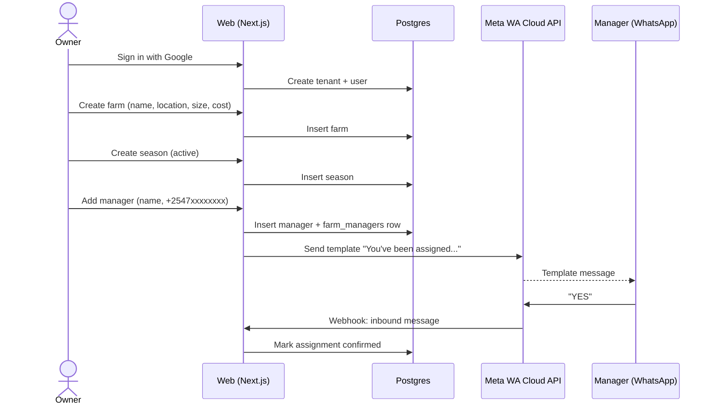
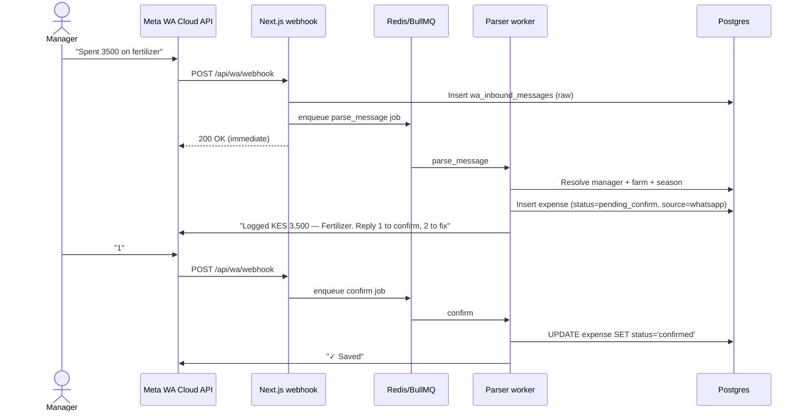
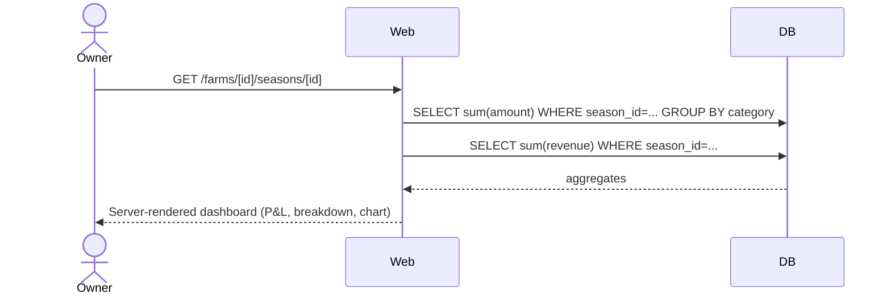
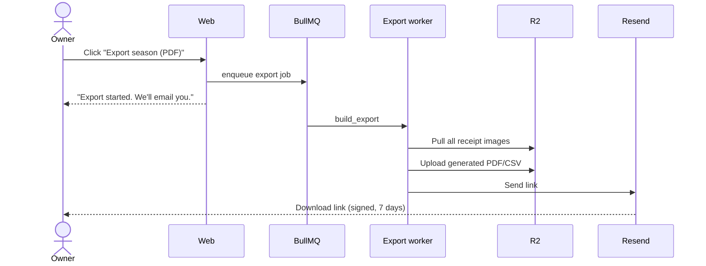
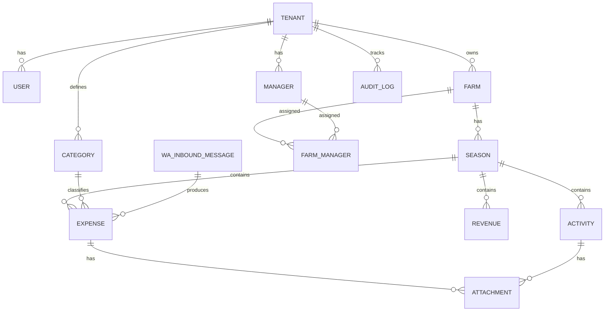
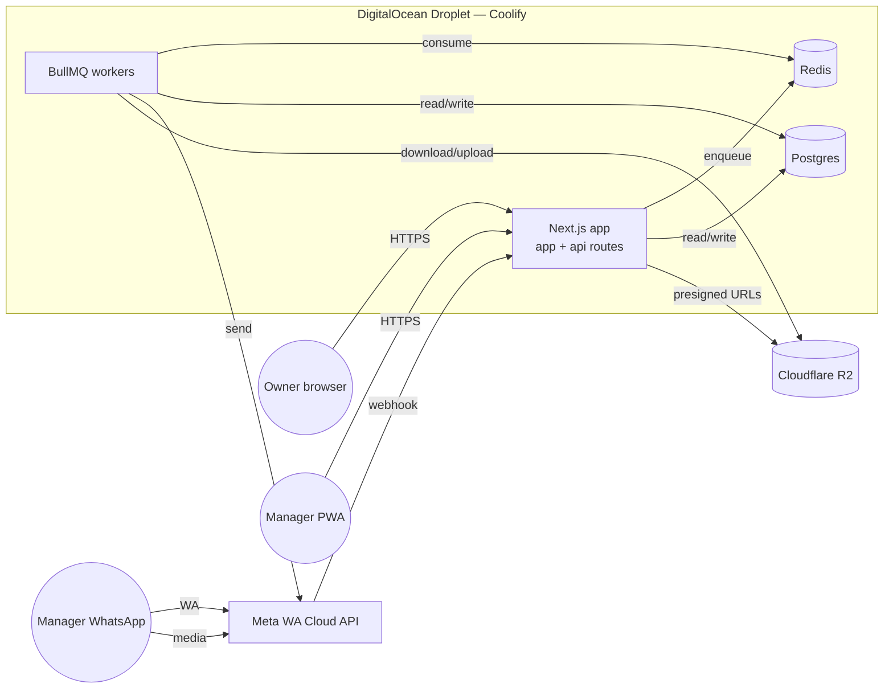

# ShambaTrack — Product Requirements Document

**Status:** Draft v1.0
**Last updated:** 2026-04-28
**Owner:** githumbi74@gmail.com
**Working title:** ShambaTrack

---

## 1. Executive Summary

ShambaTrack is a WhatsApp-first farm bookkeeping and operations log built for Kenyan farm owners who run their land remotely through on-site managers. Owners get real-time visibility into season-level expenses, profit/loss, and progress; managers get a zero-learning-curve WhatsApp interface that already lives on their phone. Receipts, activity logs, and money flow into one place — owners stop guessing, managers stop losing paper, and accountants stop reconstructing the year from photos.

> *"A simple way to track your farm's money, progress, and proof — all in one place."*

The MVP is a multi-tenant SaaS hosted on a single DigitalOcean droplet (with a clear path to a cheaper Kenyan VPS later). The data model is intentionally over-specified for the MVP feature set so that revenue tracking, AI message parsing, KRA eTIMS integration, and multi-farm benchmarking can be added later without schema rewrites.

---

## 2. Problem Statement

### 2.1 The owner's reality

The owner rents one or more farms but does not live on them. They visit occasionally. They send money for inputs (fertilizer, seed, labor, transport) on demand. They have no structured way to know:

- How much has been spent this season, by category.
- Whether spending is tracking against expectation.
- What was actually done with the money — was the fertilizer applied, or just bought?
- Whether each farm and season is profitable.
- Where the receipts are if KRA asks.

Today, this information lives in scattered WhatsApp threads, voice notes, paper receipts, and the manager's memory. The owner is forced to trust without verifying.

### 2.2 The manager's reality

The manager is on-site daily. They are not technical. They use WhatsApp constantly — for personal messages, for sending photos to the owner, for receiving M-Pesa confirmations. They do not want to install another app. They do not want to learn forms. Asking them to log into a web dashboard and fill in dropdowns is the fastest way to ensure the system is never used.

What works for them: typing or voice-noting "spent 3,500 on fertilizer" into WhatsApp the same way they message the owner today.

### 2.3 Why this problem is worth solving now

- WhatsApp Cloud API is cheap (~USD 0.005/message in Kenya) and stable enough to build on.
- Smartphone penetration among farm managers in Kenya is high enough that a WhatsApp-first UX is realistic.
- KRA eTIMS is pushing small operators toward digital record-keeping; an existing structured ledger drastically lowers the cost of compliance later.
- Existing farm-management software (FarmBrite, Agworld) targets large commercial operations and does not work the way Kenyan smallholder/medium operations actually run.

---

## 3. Personas & Jobs-to-be-Done

### 3.1 Persona A — Mary, the Owner

- 38, lives in Nairobi.
- Rents two farms in Kirinyaga (potatoes, maize).
- Has a full-time office job; visits the farms once a month.
- Comfortable with email, WhatsApp, mobile banking. Not a developer.
- Sends KES 30,000–80,000 per season per farm in inputs.

**Jobs-to-be-done**

1. *When I send money for the farm, help me see exactly what it bought, so I stop trusting blindly.*
2. *When a season ends, help me know if the farm made or lost money, so I can decide whether to renew the lease.*
3. *When the accountant asks for receipts, help me hand over a clean exportable record, so I don't spend a weekend hunting through WhatsApp.*

### 3.2 Persona B — Joseph, the Manager

- 32, lives near the farm.
- Reads and writes Swahili and basic English.
- Smartphone with WhatsApp, M-Pesa, and a browser. Limited data bundle.
- Manages day-to-day labor, buys inputs, oversees planting and spraying.

**Jobs-to-be-done**

1. *When I spend money on the farm, help me record it in 15 seconds without leaving WhatsApp, so I don't forget by evening.*
2. *When I do work on the farm, help me show the owner what was done with one photo, so they trust me without me having to explain.*
3. *When I'm unsure if an entry was saved, help me confirm it without calling the owner, so I look organized.*

---

## 4. Goals & Non-Goals

### 4.1 Goals (MVP)

- Manager logs an expense in ≤ 15 seconds via WhatsApp.
- Owner sees a real-time, season-scoped P&L for any farm in ≤ 3 taps from the dashboard home.
- Every expense can be linked to a receipt image stored permanently and downloadable.
- Owner can export a season's full ledger (CSV + PDF) that an accountant accepts as-is.
- The product is multi-tenant from day one (other owners can sign up).
- The whole stack runs on a single DigitalOcean droplet and is portable to a Kenyan VPS without rework.

### 4.2 Explicit non-goals (MVP)

- **No AI/LLM parsing of WhatsApp messages.** Rule-based parser only. AI parsing is Phase 3.
- **No KRA eTIMS submission.** CSV/PDF export only. eTIMS is Phase 3.
- **No payroll, no inventory, no input-recommendations engine.**
- **No mobile native apps** (iOS/Android). Manager PWA covers the manager's read-only needs.
- **No multi-currency.** KES only. Schema supports it; UI does not expose it.
- **No automatic revenue capture.** Owners enter revenue manually on the web.
- **No team/staff under owners.** One owner = one account. Adding teammates is Phase 2.

---

## 5. User Stories with Acceptance Criteria

### 5.1 Owner stories

**O-1. Sign up and create a farm.**
*As an owner, I want to sign up with Google and add my first farm so I can start tracking it.*
- AC1: Owner can sign in with Google in one click; no email verification step needed.
- AC2: After first sign-in, owner is prompted to create a farm with: name, location (free text), size (acres, decimal), ownership type (rented | owned), cost (KES integer if rented).
- AC3: Owner lands on the farm dashboard immediately after creating the farm.

**O-2. Create a season.**
*As an owner, I want to define a season for a farm so all subsequent expenses roll up correctly.*
- AC1: Season has name, crop type, start date, end date, status (planned | active | closed).
- AC2: Multiple seasons per farm are allowed; only one season can be `active` at a time per farm.
- AC3: When a manager logs an expense, it auto-attaches to the farm's currently active season.

**O-3. Invite a manager.**
*As an owner, I want to assign a manager (by WhatsApp number) to a farm so their messages get routed correctly.*
- AC1: Owner enters a manager's name and WhatsApp number (E.164 format).
- AC2: System sends the manager a WhatsApp template message: *"You've been assigned as manager of [farm]. Reply YES to confirm."*
- AC3: On YES, the manager is marked `active` for that farm.
- AC4: A farm has exactly one active manager at any time. Reassigning auto-unassigns the previous one (with assigned_at/unassigned_at preserved in history).
- AC5: A single manager (one WhatsApp number) can be active on multiple farms simultaneously, possibly across different owners.

**O-4. View a season P&L.**
*As an owner, I want a one-screen summary of total cost, total revenue, and profit/loss for a season.*
- AC1: Dashboard shows: total cost (KES), total revenue (KES), profit/loss (KES), cost breakdown by category (bar or pie).
- AC2: Switching farm or season updates the view.
- AC3: Loads on a 3G connection in ≤ 2 seconds (server-rendered, minimal JS).

**O-5. Browse and filter expenses.**
*As an owner, I want to see every expense, filterable by category, date range, and source.*
- AC1: Expense list paginated; filters: farm, season, category, date range, source (whatsapp | web), status (pending | confirmed | rejected).
- AC2: Each row shows: date, amount, category, note, source icon, receipt thumbnail (if any).
- AC3: Clicking a row opens a detail panel with the full receipt image and the original WhatsApp message text (if applicable).

**O-6. Add revenue.**
*As an owner, I want to log a revenue entry for a season.*
- AC1: Form: date, amount (KES), source note (e.g., "Sold 5 bags maize to broker"), free-text note.
- AC2: Revenue rolls into the season P&L.

**O-7. Export records.**
*As an owner, I want to export a season's records as CSV and PDF.*
- AC1: CSV columns: date, type (expense|revenue), category, amount, currency, note, source, receipt URL (signed, 7-day).
- AC2: PDF includes summary header, full table, and a receipt gallery appendix.
- AC3: Export job runs in the background; owner gets an email with a download link when ready.

**O-8. Review activity timeline.**
*As an owner, I want a chronological feed of activities with photos.*
- AC1: Feed shows: date, manager name, activity text, attached photos.
- AC2: Filterable by farm and date range.

### 5.2 Manager stories

**M-1. Log an expense via WhatsApp.**
*As a manager, I want to text an expense and have it recorded.*
- AC1: Manager texts e.g. *"Spent 3,500 on fertilizer"* to the ShambaTrack WhatsApp number.
- AC2: Within 5 seconds, bot replies: *"Logged: KES 3,500 — Fertilizer. Reply 1 to confirm, 2 to fix."*
- AC3: On `1`, status flips to `confirmed`. On `2`, bot asks for category, then amount.
- AC4: If no reply within 24h, expense auto-transitions to `confirmed` (with a flag for owner review).

**M-2. Attach a receipt photo.**
*As a manager, I want to send a photo and have it saved as a receipt.*
- AC1: If a photo is sent within 60 seconds of an expense message, it is auto-attached to that expense.
- AC2: If a photo is sent standalone, bot replies: *"Got the receipt. Which expense? Reply with the amount or 'new' to create one."*
- AC3: Photos are stored on R2 and accessible only via signed URLs.

**M-3. Log farm activity.**
*As a manager, I want to text or send a photo of farm progress.*
- AC1: Manager texts e.g. *"Planted 2 acres potatoes today"* — bot logs as activity (no money detected → activity, not expense).
- AC2: Photos sent without an expense context within the last hour are tagged as activity progress.

**M-4. View my own log.**
*As a manager, I want to see my recent entries on a phone-friendly page.*
- AC1: Manager opens a magic link from WhatsApp (`/m/[token]`) that auto-authenticates by their WA number.
- AC2: Page lists last 30 days of entries (read-only): expenses, activities, photos.
- AC3: PWA installable; works on a 3G connection.

**M-5. Switch farms (multi-farm manager).**
*As a manager who handles multiple farms, I want to choose which farm an entry applies to when it isn't obvious.*
- AC1: If a manager is active on > 1 farm, the bot prompts: *"Which farm? 1) Farm A  2) Farm B"* on every new expense unless a default is set.
- AC2: Manager can set a default farm via the WA command `/default 1`.
- AC3: Manager can override per message with `farm:A` or by selecting the number after the prompt.

---

## 6. Core User Flows

### 6.1 Owner setup



### 6.2 Manager logs expense via WhatsApp



### 6.3 Owner views season P&L



### 6.4 Receipt export



---

## 7. MVP Scope

| Feature | In MVP | Phase 2 | Phase 3 |
|---|:---:|:---:|:---:|
| Owner Google sign-in | ✅ | | |
| Farm setup | ✅ | | |
| Season management | ✅ | | |
| Manager assignment via WA confirm | ✅ | | |
| WhatsApp expense logging (rule parser) | ✅ | | |
| Tap-to-confirm WhatsApp UX | ✅ | | |
| Receipt photo attachment | ✅ | | |
| Activity logging via WA | ✅ | | |
| Owner dashboard (cost, revenue, P&L) | ✅ | | |
| Manual revenue entry (web) | ✅ | | |
| Receipt vault (gallery) | ✅ | | |
| CSV + PDF export | ✅ | | |
| Manager read-only PWA | ✅ | | |
| Multi-farm-per-manager routing | ✅ | | |
| Soft delete + audit log | ✅ | | |
| Owner-side teams (multiple users per tenant) | | ✅ | |
| Cost-vs-budget alerts | | ✅ | |
| Activity timeline rich view | | ✅ | |
| Per-season templates (planned costs) | | ✅ | |
| AI-powered WhatsApp parsing | | | ✅ |
| KRA eTIMS submission | | | ✅ |
| Multi-farm benchmarking | | | ✅ |
| Multi-currency | | | ✅ |
| Mobile native apps | | | ✅ |

---

## 8. Functional Requirements

### 8.1 Tenancy

- One tenant = one owner account.
- All business records (farms, seasons, expenses, revenues, activities, attachments) carry a non-null `tenant_id`.
- Cross-tenant reads are forbidden at the database level via Postgres Row-Level Security.
- A manager is also tenant-scoped (a manager exists *within* an owner's tenant, even if their WhatsApp number is reused across owners). When the same E.164 number is added by two different owners, the system creates two `managers` rows — one per tenant — but routes inbound messages to the correct one using the `farm_managers.assigned_at IS NOT NULL AND unassigned_at IS NULL` invariant. Disambiguation rules see §9.4.

### 8.2 Farms

- Fields: `name`, `location`, `size_acres` (decimal), `ownership_type` (`owned` | `rented`), `cost_kes_cents` (nullable for owned), `archived_at` (nullable).
- Owner can archive a farm; archived farms are hidden from the manager's WA routing.

### 8.3 Seasons

- Fields: `name`, `crop_type` (free text in MVP, normalized table later), `start_date`, `end_date`, `status` (`planned` | `active` | `closed`).
- Constraint: at most one `active` season per farm. Enforced via partial unique index.
- Closing a season is a soft state change; expenses already attached remain attached.

### 8.4 Categories

- System defaults seeded at install: `fertilizer`, `seeds`, `labor`, `transport`, `chemicals`, `equipment`, `irrigation`, `land_prep`, `harvest`, `other`.
- Tenants can add custom categories. System defaults have `tenant_id IS NULL`.
- Each category has `name`, `slug`, `parent_id` (nullable; for future hierarchy), `color` (hex; for charts).

### 8.5 Expenses

- Fields: `tenant_id`, `farm_id`, `season_id`, `category_id`, `manager_id` (nullable; null when entered by owner on web), `amount_cents` (BIGINT), `currency` (CHAR(3) default `'KES'`), `occurred_on` (date), `note`, `source` (`whatsapp` | `web` | `import`), `status` (`pending_confirm` | `confirmed` | `rejected`), `wa_inbound_message_id` (nullable FK), `created_at`, `updated_at`, `deleted_at`.
- Lifecycle: `pending_confirm` → `confirmed` (on user `1`, after web edit, or after 24h auto-confirm) or `rejected` (on user explicit cancel).
- Owner can edit any field of any expense from the web; edits are recorded in `audit_log`.

### 8.6 Revenues

- Owner-only (web).
- Fields: `tenant_id`, `farm_id`, `season_id`, `amount_cents`, `currency`, `occurred_on`, `source_note`, `note`, `created_at`, `deleted_at`.

### 8.7 Activities

- Fields: `tenant_id`, `farm_id`, `season_id`, `manager_id` (nullable), `body`, `occurred_on`, `source`, `created_at`, `deleted_at`.
- Distinguished from expenses: activities have no money. Parser routes any inbound WA message lacking a parseable amount → activity.

### 8.8 Attachments

- Polymorphic: `owner_type` (`expense` | `activity`), `owner_id`.
- Fields: `storage_key` (R2 path), `mime_type`, `size_bytes`, `sha256` (for dedup), `uploaded_by_user_id` (nullable), `uploaded_by_manager_id` (nullable), `created_at`.
- Stored on Cloudflare R2 in path: `t/{tenant_id}/{owner_type}/{owner_id}/{uuid}.{ext}`.
- Public URL never exposed; reads go through signed URLs (default expiry 1 hour; 7 days for export downloads).

### 8.9 Reports & Export

- **CSV.** Columns: `date, type, farm, season, category, amount_kes, note, source, status, receipt_url`.
- **PDF.** Cover page (farm, season, totals), expense table, revenue table, P&L summary, receipt gallery (one per page, with caption).
- **Generation.** Async via BullMQ. Result stored on R2; signed link emailed via Resend; link valid 7 days.

---

## 9. WhatsApp Integration Specification

### 9.1 Provider

- **Meta WhatsApp Cloud API** (direct integration, no Twilio).
- Requires a Meta Business account, a verified business, and a WhatsApp Business phone number.
- Webhooks delivered to `https://app.shambatrack.com/api/wa/webhook`.
- Verify token rotates per environment; stored in `WA_WEBHOOK_VERIFY_TOKEN`.

### 9.2 Webhook contract

- **Inbound POST.** Payload validated against Meta's signature header (`X-Hub-Signature-256`) using `WA_APP_SECRET`.
- Handler is **non-blocking**: on receipt, the raw payload is persisted to `wa_inbound_messages` and a BullMQ job is enqueued. Webhook returns 200 within 200 ms.
- Idempotency: `wa_message_id` (Meta's `messages[].id`) is unique. Duplicate deliveries are no-ops.

### 9.3 Parser rules (rule-based, no LLM in MVP)

The parser runs in a worker on each `wa_inbound_messages` row.

1. **Amount detection.** Regex: `\b(\d{1,3}(?:[,.]?\d{3})*|\d+)(?:\.\d+)?\b`. Numbers > 99 treated as KES amount (assumes no shillings field below 100). Take the first match.
2. **Category detection.** Tokenize lowercase; match against a per-tenant keyword map seeded with common Kenyan farming terms:
   - `fertilizer | fert | dap | can | npk | manure` → fertilizer
   - `seed | seeds` → seeds
   - `labour | labor | mjengo | wafanyikazi | workers` → labor
   - `transport | matatu | lorry | pikipiki | fare` → transport
   - `spray | chemical | pesticide | herbicide` → chemicals
   - `pump | jembe | panga | tools` → equipment
   - `water | irrigation` → irrigation
   - `plough | plow | tilling | land prep` → land_prep
   - `harvest | harvesting | picking` → harvest
   - First keyword wins. Tie → `other`. No keyword → `other`.
3. **Activity detection.** If amount is missing AND text length > 0 → activity. If amount present → expense.
4. **Photo handling.** Inbound `image` messages are downloaded from Meta, hashed (sha256), uploaded to R2. If a recent (≤ 60s) expense from the same manager exists → attach. Else → flag as `unattached`, prompt manager.
5. **Multi-farm disambiguation.** If the manager is active on > 1 farm and no farm hint is in the message, bot replies with farm options. Until manager replies with a number, the message stays in `pending_routing`.

### 9.4 Confirmation flow

- After insert, parser sends: *"Logged: KES {amount} — {category}. Reply 1 to confirm, 2 to fix."*
- `1` → set `status='confirmed'`, reply `✓`.
- `2` → enter fix flow: *"What's the right category? Reply: fertilizer / seeds / labor / transport / chemicals / equipment / other"*. Then *"What's the right amount?"*. Apply edits, reset status to `confirmed`.
- Auto-confirm timer: after 24h with no reply, status flips to `confirmed` and a flag (`auto_confirmed=true`) is set so the owner can review.

### 9.5 Templates required (Meta approval)

Submit these for Meta business approval in advance:

- `manager_assignment_v1` — *"You've been assigned as manager of {{1}} by {{2}}. Reply YES to confirm, or NO to decline."*
- `manager_login_v1` — *"Tap this link to view your ShambaTrack log: {{1}}. Link expires in 24 hours."*
- `weekly_summary_owner_v1` (Phase 2) — *"This week on {{1}}: {{2}} expenses totaling KES {{3}}. View: {{4}}."*

### 9.6 Outbound rate limits

- Meta limits unverified businesses to 1,000 conversations/day. Adequate for MVP.
- All outbound goes through `wa_outbound_messages` table for audit and retry.

---

## 10. Authentication & Authorization

### 10.1 Owner authentication — Google OAuth

- Provider: Google via Auth.js (NextAuth.js v5).
- On first sign-in: a `tenants` row is created with the owner's Google `sub`, email, and name. A `users` row is created and linked.
- Sessions: JWT, 30-day idle expiry; HTTP-only secure cookie.
- No email/password fallback in MVP.

### 10.2 Manager authentication — WhatsApp number identity

- Manager has no password and no separate signup.
- Web access flow:
  1. Manager texts `/dashboard` to the WA number.
  2. App generates a 24-hour signed JWT bound to the manager's WA number and tenant_id.
  3. Bot replies with `https://app.shambatrack.com/m/[token]`.
  4. The route validates the token, sets a session cookie, and renders the read-only PWA.
- All write operations from the manager surface flow through WhatsApp, never the web.

### 10.3 Authorization model

- `tenants` is the security boundary. Every query is scoped to a tenant.
- Roles in MVP: `owner` (the only user role) and `manager` (a non-user actor identified by phone).
- Postgres Row-Level Security policies enforce `tenant_id = current_setting('app.tenant_id')::uuid` on all business tables. The application sets this GUC at the start of each request after auth.

### 10.4 RLS policy example

```sql
ALTER TABLE expenses ENABLE ROW LEVEL SECURITY;

CREATE POLICY tenant_isolation_expenses ON expenses
  USING (tenant_id = current_setting('app.tenant_id', true)::uuid)
  WITH CHECK (tenant_id = current_setting('app.tenant_id', true)::uuid);
```

The webhook worker uses a privileged service role that bypasses RLS but always sets `app.tenant_id` based on the resolved manager → farm → tenant chain.

---

## 11. Data Model

### 11.1 Design principles encoded

1. `tenant_id` on every business table.
2. Money as `amount_cents BIGINT`. `currency CHAR(3)` default `'KES'`.
3. Soft deletes (`deleted_at TIMESTAMPTZ`) on user-visible entities.
4. `source` enum on expenses/activities for analytics.
5. `status` enum on expenses for the WA confirm flow.
6. Polymorphic `attachments` (`owner_type`, `owner_id`).
7. Raw `wa_inbound_messages` table for replay-after-parser-improves.
8. `audit_log` with before/after JSONB for undo and compliance.
9. `farm_managers` join with `assigned_at`/`unassigned_at` history.
10. `categories.tenant_id NULL` reserved for system defaults.

### 11.2 Prisma schema (full)

```prisma
// schema.prisma
generator client {
  provider = "prisma-client-js"
}

datasource db {
  provider = "postgresql"
  url      = env("DATABASE_URL")
}

enum Currency {
  KES
}

enum OwnershipType {
  owned
  rented
}

enum SeasonStatus {
  planned
  active
  closed
}

enum ExpenseSource {
  whatsapp
  web
  import
}

enum ExpenseStatus {
  pending_confirm
  confirmed
  rejected
}

enum AttachmentOwnerType {
  expense
  activity
}

enum WaInboundStatus {
  received
  parsed
  failed
  pending_routing
}

model Tenant {
  id          String   @id @default(uuid()) @db.Uuid
  google_sub  String   @unique
  email       String
  name        String?
  created_at  DateTime @default(now()) @db.Timestamptz
  deleted_at  DateTime? @db.Timestamptz

  users        User[]
  managers     Manager[]
  farms        Farm[]
  seasons      Season[]
  categories   Category[]
  expenses     Expense[]
  revenues     Revenue[]
  activities   Activity[]
  attachments  Attachment[]
  wa_inbound   WaInboundMessage[]
  wa_outbound  WaOutboundMessage[]
  audit_logs   AuditLog[]
}

model User {
  id          String   @id @default(uuid()) @db.Uuid
  tenant_id   String   @db.Uuid
  email       String
  name        String?
  role        String   @default("owner")
  created_at  DateTime @default(now()) @db.Timestamptz

  tenant      Tenant   @relation(fields: [tenant_id], references: [id])

  @@index([tenant_id])
}

model Manager {
  id              String   @id @default(uuid()) @db.Uuid
  tenant_id       String   @db.Uuid
  whatsapp_e164   String
  display_name    String
  default_farm_id String?  @db.Uuid
  created_at      DateTime @default(now()) @db.Timestamptz
  deactivated_at  DateTime? @db.Timestamptz

  tenant          Tenant         @relation(fields: [tenant_id], references: [id])
  default_farm    Farm?          @relation("ManagerDefaultFarm", fields: [default_farm_id], references: [id])
  assignments     FarmManager[]
  expenses        Expense[]
  activities      Activity[]

  @@unique([tenant_id, whatsapp_e164])
  @@index([whatsapp_e164])
}

model Farm {
  id              String   @id @default(uuid()) @db.Uuid
  tenant_id       String   @db.Uuid
  name            String
  location        String
  size_acres      Decimal  @db.Decimal(8, 3)
  ownership_type  OwnershipType
  cost_kes_cents  BigInt?
  currency        Currency @default(KES)
  archived_at     DateTime? @db.Timestamptz
  created_at      DateTime @default(now()) @db.Timestamptz

  tenant          Tenant        @relation(fields: [tenant_id], references: [id])
  seasons         Season[]
  managers        FarmManager[]
  expenses        Expense[]
  revenues        Revenue[]
  activities      Activity[]
  default_for     Manager[]     @relation("ManagerDefaultFarm")

  @@index([tenant_id])
}

model FarmManager {
  id              String   @id @default(uuid()) @db.Uuid
  farm_id         String   @db.Uuid
  manager_id      String   @db.Uuid
  assigned_at     DateTime @default(now()) @db.Timestamptz
  unassigned_at   DateTime? @db.Timestamptz

  farm            Farm     @relation(fields: [farm_id], references: [id])
  manager         Manager  @relation(fields: [manager_id], references: [id])

  // Partial unique index in raw SQL migration:
  // CREATE UNIQUE INDEX one_active_manager_per_farm
  //   ON farm_managers (farm_id) WHERE unassigned_at IS NULL;

  @@index([manager_id])
  @@index([farm_id])
}

model Season {
  id          String   @id @default(uuid()) @db.Uuid
  tenant_id   String   @db.Uuid
  farm_id     String   @db.Uuid
  name        String
  crop_type   String
  start_date  DateTime @db.Date
  end_date    DateTime @db.Date
  status      SeasonStatus @default(planned)
  created_at  DateTime @default(now()) @db.Timestamptz
  closed_at   DateTime? @db.Timestamptz

  tenant      Tenant   @relation(fields: [tenant_id], references: [id])
  farm        Farm     @relation(fields: [farm_id], references: [id])
  expenses    Expense[]
  revenues    Revenue[]
  activities  Activity[]

  // Partial unique index in raw SQL migration:
  // CREATE UNIQUE INDEX one_active_season_per_farm
  //   ON seasons (farm_id) WHERE status = 'active';

  @@index([tenant_id, farm_id])
}

model Category {
  id          String   @id @default(uuid()) @db.Uuid
  tenant_id   String?  @db.Uuid  // NULL = system default
  name        String
  slug        String
  parent_id   String?  @db.Uuid
  color       String?  @db.VarChar(7)
  created_at  DateTime @default(now()) @db.Timestamptz

  tenant      Tenant?  @relation(fields: [tenant_id], references: [id])
  parent      Category? @relation("CategoryHierarchy", fields: [parent_id], references: [id])
  children    Category[] @relation("CategoryHierarchy")
  expenses    Expense[]

  @@unique([tenant_id, slug])
  @@index([tenant_id])
}

model Expense {
  id                       String   @id @default(uuid()) @db.Uuid
  tenant_id                String   @db.Uuid
  farm_id                  String   @db.Uuid
  season_id                String   @db.Uuid
  category_id              String   @db.Uuid
  manager_id               String?  @db.Uuid
  amount_cents             BigInt
  currency                 Currency @default(KES)
  occurred_on              DateTime @db.Date
  note                     String?
  source                   ExpenseSource
  status                   ExpenseStatus @default(pending_confirm)
  auto_confirmed           Boolean  @default(false)
  wa_inbound_message_id    String?  @db.Uuid
  created_at               DateTime @default(now()) @db.Timestamptz
  updated_at               DateTime @updatedAt @db.Timestamptz
  deleted_at               DateTime? @db.Timestamptz

  tenant                   Tenant   @relation(fields: [tenant_id], references: [id])
  farm                     Farm     @relation(fields: [farm_id], references: [id])
  season                   Season   @relation(fields: [season_id], references: [id])
  category                 Category @relation(fields: [category_id], references: [id])
  manager                  Manager? @relation(fields: [manager_id], references: [id])
  wa_inbound_message       WaInboundMessage? @relation(fields: [wa_inbound_message_id], references: [id])

  @@index([tenant_id, farm_id, season_id, occurred_on])
  @@index([status])
}

model Revenue {
  id            String   @id @default(uuid()) @db.Uuid
  tenant_id     String   @db.Uuid
  farm_id       String   @db.Uuid
  season_id     String   @db.Uuid
  amount_cents  BigInt
  currency      Currency @default(KES)
  occurred_on   DateTime @db.Date
  source_note   String?
  note          String?
  created_at    DateTime @default(now()) @db.Timestamptz
  deleted_at    DateTime? @db.Timestamptz

  tenant        Tenant   @relation(fields: [tenant_id], references: [id])
  farm          Farm     @relation(fields: [farm_id], references: [id])
  season        Season   @relation(fields: [season_id], references: [id])

  @@index([tenant_id, farm_id, season_id, occurred_on])
}

model Activity {
  id          String   @id @default(uuid()) @db.Uuid
  tenant_id   String   @db.Uuid
  farm_id     String   @db.Uuid
  season_id   String?  @db.Uuid
  manager_id  String?  @db.Uuid
  body        String
  occurred_on DateTime @db.Date
  source      ExpenseSource
  created_at  DateTime @default(now()) @db.Timestamptz
  deleted_at  DateTime? @db.Timestamptz

  tenant      Tenant   @relation(fields: [tenant_id], references: [id])
  farm        Farm     @relation(fields: [farm_id], references: [id])
  season      Season?  @relation(fields: [season_id], references: [id])
  manager     Manager? @relation(fields: [manager_id], references: [id])

  @@index([tenant_id, farm_id, occurred_on])
}

model Attachment {
  id                       String   @id @default(uuid()) @db.Uuid
  tenant_id                String   @db.Uuid
  owner_type               AttachmentOwnerType
  owner_id                 String   @db.Uuid
  storage_key              String
  mime_type                String
  size_bytes               BigInt
  sha256                   String
  uploaded_by_user_id      String?  @db.Uuid
  uploaded_by_manager_id   String?  @db.Uuid
  created_at               DateTime @default(now()) @db.Timestamptz

  tenant                   Tenant   @relation(fields: [tenant_id], references: [id])

  @@index([tenant_id, owner_type, owner_id])
  @@index([sha256])
}

model WaInboundMessage {
  id              String   @id @default(uuid()) @db.Uuid
  tenant_id       String?  @db.Uuid   // null until resolved
  manager_id      String?  @db.Uuid
  from_e164       String
  wa_message_id   String   @unique
  message_type    String
  body            String?
  media_storage_key String?
  received_at     DateTime @db.Timestamptz
  processed_at    DateTime? @db.Timestamptz
  status          WaInboundStatus @default(received)
  parse_result    Json?
  error           String?

  tenant          Tenant?  @relation(fields: [tenant_id], references: [id])
  expenses        Expense[]

  @@index([from_e164, received_at])
  @@index([status])
}

model WaOutboundMessage {
  id                  String   @id @default(uuid()) @db.Uuid
  tenant_id           String   @db.Uuid
  to_e164             String
  body                String
  template_name       String?
  status              String
  sent_at             DateTime? @db.Timestamptz
  wa_message_id       String?
  related_expense_id  String?  @db.Uuid
  error               String?
  created_at          DateTime @default(now()) @db.Timestamptz

  tenant              Tenant   @relation(fields: [tenant_id], references: [id])

  @@index([tenant_id, created_at])
}

model AuditLog {
  id           String   @id @default(uuid()) @db.Uuid
  tenant_id    String   @db.Uuid
  actor_type   String
  actor_id     String   @db.Uuid
  action       String
  entity_type  String
  entity_id    String   @db.Uuid
  before       Json?
  after        Json?
  created_at   DateTime @default(now()) @db.Timestamptz

  tenant       Tenant   @relation(fields: [tenant_id], references: [id])

  @@index([tenant_id, entity_type, entity_id])
  @@index([tenant_id, created_at])
}
```

### 11.3 ER diagram



### 11.4 Critical SQL migrations beyond Prisma

```sql
-- Enforce one active manager per farm
CREATE UNIQUE INDEX one_active_manager_per_farm
  ON farm_managers (farm_id) WHERE unassigned_at IS NULL;

-- Enforce one active season per farm
CREATE UNIQUE INDEX one_active_season_per_farm
  ON seasons (farm_id) WHERE status = 'active';

-- RLS on all business tables (example for expenses; repeat for others)
ALTER TABLE expenses ENABLE ROW LEVEL SECURITY;
CREATE POLICY tenant_isolation ON expenses
  USING (tenant_id = current_setting('app.tenant_id', true)::uuid)
  WITH CHECK (tenant_id = current_setting('app.tenant_id', true)::uuid);
```

---

## 12. Tech Stack & Architecture

### 12.1 Stack

| Layer | Choice |
|---|---|
| App framework | Next.js 14+ (App Router), TypeScript |
| Database | Postgres 16 |
| ORM | Prisma |
| Auth | Auth.js v5 (Google for owners; custom JWT issuer for managers) |
| UI | Tailwind CSS, shadcn/ui |
| Forms / validation | react-hook-form + zod |
| Background jobs | BullMQ on Redis 7 |
| Object storage | Cloudflare R2 (S3 SDK) |
| Email | Resend |
| WhatsApp | Meta WhatsApp Cloud API |
| Charts | Recharts |
| PDF generation | `@react-pdf/renderer` (server-side) |
| Container | Docker, multi-stage build |
| Orchestration | Coolify on a single DO droplet |
| Observability | Pino logs → Better Stack (or Grafana Loki self-hosted) |
| Error tracking | Sentry (free tier) |

### 12.2 Architecture diagram



### 12.3 Repository layout

```
farm-management/
├── app/                         # Next.js App Router
│   ├── (owner)/                 # Owner dashboard routes
│   │   ├── farms/[id]/...
│   │   └── seasons/[id]/...
│   ├── m/[token]/               # Manager PWA
│   ├── api/
│   │   ├── auth/[...nextauth]/  # Owner auth
│   │   ├── wa/webhook/          # WA inbound
│   │   └── exports/             # Export job triggers
│   └── layout.tsx
├── lib/
│   ├── db.ts                    # Prisma client + tenant scoping
│   ├── wa/                      # Meta API client + parser
│   ├── jobs/                    # BullMQ job definitions
│   ├── auth/                    # Auth.js config + manager JWT
│   └── r2.ts                    # S3-compatible client
├── workers/
│   └── index.ts                 # BullMQ worker entry
├── prisma/
│   └── schema.prisma
├── public/
│   └── manifest.webmanifest     # PWA manifest
├── docker/
│   ├── Dockerfile               # Multi-stage
│   └── docker-compose.yml       # local dev
├── package.json
└── README.md
```

### 12.4 Key library versions (target)

- next: ^15
- react: ^19
- prisma: ^5
- next-auth: ^5 (Auth.js)
- bullmq: ^5
- ioredis: ^5
- @aws-sdk/client-s3: ^3 (used against R2)
- zod: ^3
- recharts: ^2

---

## 13. Non-Functional Requirements

| Requirement | Target |
|---|---|
| Owner dashboard first paint on 3G | ≤ 2.0 s |
| Manager PWA total JS payload | ≤ 200 KB gzipped |
| WhatsApp webhook ack latency | ≤ 200 ms (write to DB + enqueue + return 200) |
| WhatsApp parser → bot reply latency | ≤ 5 s p95 |
| Database availability | 99.5% (single-droplet MVP) |
| Backups | Nightly `pg_dump` to R2; retain 30 days |
| Receipt durability | R2 `Standard` class (11×9s); soft-deleted attachments retained 90 days |
| Localization | English only in MVP; Swahili WA replies in Phase 2 |
| Accessibility | WCAG 2.1 AA on owner dashboard; keyboard navigable |
| Privacy | All PII encrypted at rest (Postgres + R2 server-side encryption); no third-party analytics in MVP |
| Offline tolerance | Manager PWA caches last-30-days view via service worker; web form is online-only |

---

## 14. Compliance & Reporting

### 14.1 KRA-friendly record-keeping

- Every confirmed expense has: date, amount, category, note, optional receipt image.
- CSV export schema is stable and documented; safe for accountants to import into QuickBooks, Sage, or Tally.
- Receipt images are downloadable at any time; signed URLs are 7-day for exports, 1-hour for in-app viewing.
- Soft-deleted records remain in the database for 7 years (configurable). Hard delete is only triggered by tenant deletion request.

### 14.2 Data retention

| Entity | Retention |
|---|---|
| Active records | Indefinite |
| Soft-deleted user records | 7 years |
| `wa_inbound_messages` raw bodies | 2 years |
| `audit_log` | 7 years |
| Tenant deletion request | 30-day grace, then hard delete |

### 14.3 Privacy

- Manager phone numbers are PII. Stored as-is (no hashing) because the system must send them messages. Access is RLS-scoped.
- Tenants own their data. Data export is available on request as a single ZIP (CSV + receipts) within 7 days.

---

## 15. Hosting & Deployment

### 15.1 Initial topology (DigitalOcean droplet)

- **Droplet:** `s-2vcpu-4gb` ($24/mo) — covers app + workers + Postgres + Redis comfortably for the first ~50 tenants.
- **Region:** Frankfurt or London (closest low-latency for Nairobi until DO offers a Kenya region).
- **OS:** Ubuntu 22.04 LTS.
- **Orchestration:** Coolify (open-source Heroku alternative). Manages Docker containers, TLS via Let's Encrypt, env vars, deploys from Git.
- **Domain:** `app.shambatrack.com` (or chosen alternative).
- **TLS:** Auto-provisioned by Coolify.
- **Firewall:** Only 80/443 inbound; SSH locked to operator IP or via DO console.

### 15.2 Service containers

| Container | Image | Purpose |
|---|---|---|
| `web` | Custom (multi-stage Next.js standalone) | App server |
| `worker` | Same image, alternate entry | BullMQ workers |
| `postgres` | `postgres:16-alpine` | Primary DB |
| `redis` | `redis:7-alpine` | Queue + sessions |
| `coolify` | `coolify/coolify` | Orchestrator (separate droplet recommended for prod) |

### 15.3 Environment variables

```
# App
NEXT_PUBLIC_APP_URL=https://app.shambatrack.com
NODE_ENV=production
SESSION_SECRET=...

# Auth
GOOGLE_CLIENT_ID=...
GOOGLE_CLIENT_SECRET=...
NEXTAUTH_SECRET=...
NEXTAUTH_URL=https://app.shambatrack.com
MANAGER_JWT_SECRET=...

# Database
DATABASE_URL=postgresql://...

# Redis
REDIS_URL=redis://...

# Cloudflare R2
R2_ACCOUNT_ID=...
R2_ACCESS_KEY_ID=...
R2_SECRET_ACCESS_KEY=...
R2_BUCKET=shambatrack-prod
R2_PUBLIC_URL_BASE=https://...

# WhatsApp
WA_PHONE_NUMBER_ID=...
WA_BUSINESS_ACCOUNT_ID=...
WA_APP_SECRET=...
WA_ACCESS_TOKEN=...
WA_WEBHOOK_VERIFY_TOKEN=...

# Email
RESEND_API_KEY=...
EMAIL_FROM=ShambaTrack <noreply@shambatrack.com>

# Observability
SENTRY_DSN=...
LOG_LEVEL=info
```

### 15.4 Backups

- Postgres: nightly `pg_dump | gzip` cron, uploaded to R2 bucket `shambatrack-backups`. 30-day retention via R2 lifecycle rule.
- R2 attachments: Cloudflare versioning enabled on bucket; soft-deletes recoverable for 30 days.
- Test restore quarterly.

### 15.5 Migration path to Kenya VPS

1. Provision target VPS (Ubuntu 22.04, ≥ 4 GB RAM).
2. Install Coolify on target.
3. Push the same Docker image to a registry (GitHub Container Registry, free).
4. Restore latest Postgres dump.
5. Cut DNS over (low TTL set in advance).
6. R2 stays as-is (zero egress fees mean no migration cost).

Total expected downtime: ≤ 30 minutes for the first migration.

---

## 16. Phased Roadmap

### Phase 1 — MVP (this PRD)

- Owner Google sign-in.
- Farm + season + manager assignment.
- WhatsApp expense + activity logging with confirm flow.
- Receipt photo attachment (R2).
- Owner dashboard (P&L, breakdown, expense/activity lists).
- Manual revenue entry.
- CSV + PDF export.
- Manager read-only PWA.

### Phase 2 — After ~10 paying tenants

- Owner-side teams (multiple users per tenant).
- Budget vs. actual alerts.
- Swahili language for WA replies.
- Recurring expense templates.
- Improved activity timeline (richer media, comments).
- Per-category cost trend charts.
- Bulk import (CSV) for legacy data.

### Phase 3 — Scale

- AI-powered WA parsing (Anthropic Claude with prompt caching).
- KRA eTIMS integration.
- Multi-farm benchmarking (anonymized cohort comparisons).
- Multi-currency.
- Mobile native apps (iOS, Android) with offline-first.
- Public API for accountants.

---

## 17. Success Metrics

| Metric | MVP target (90 days post-launch) |
|---|---|
| % of expenses logged within 24h of incurrence (per tenant) | ≥ 70% |
| Weekly active manager rate | ≥ 60% |
| Owner DAU on dashboard | ≥ 40% |
| Avg. time per expense entry (WA) | ≤ 15 seconds |
| Auto-confirmed (no `1` reply) expense rate | ≤ 25% |
| WA parser correct-classification rate | ≥ 85% |
| Exports per tenant per month | ≥ 1 |
| Owner retention (month-2) | ≥ 70% |

---

## 18. Open Questions

1. **Meta business verification.** Owner needs to register and verify a business with Meta before the WA Cloud API can move out of test mode. Lead time: 1–3 days. *Action:* start verification before development is complete.
2. **SMS fallback.** If a manager loses WA access (uninstall, ban), is there an SMS-based path? Not in MVP. Decide for Phase 2.
3. **Co-owners / multiple users per tenant.** Out of MVP scope. The schema supports it (`users` table), but routing, permissions, and invites are deferred to Phase 2.
4. **Hosting region in Africa.** DigitalOcean does not yet have a Kenyan region. MVP runs in EU/UK. Decide which Kenyan VPS provider to migrate to (e.g., Safaricom Cloud, Truehost, Liquid Telecom) before usage volume makes EU latency painful.
5. **Subscription billing.** Multi-tenant SaaS but no billing in MVP. Free for early adopters. Decide pricing and integrate Stripe/IntaSend in Phase 2.
6. **Default farm for multi-farm managers.** Bot prompts every time unless `/default` is set. Should we instead infer the default from "most recent farm logged to in last 7 days"? Decision deferred — start with explicit `/default`.

---

*End of PRD v1.0.*
